# Diagrammes Architecture - ETL Experiment

## Architecture générale

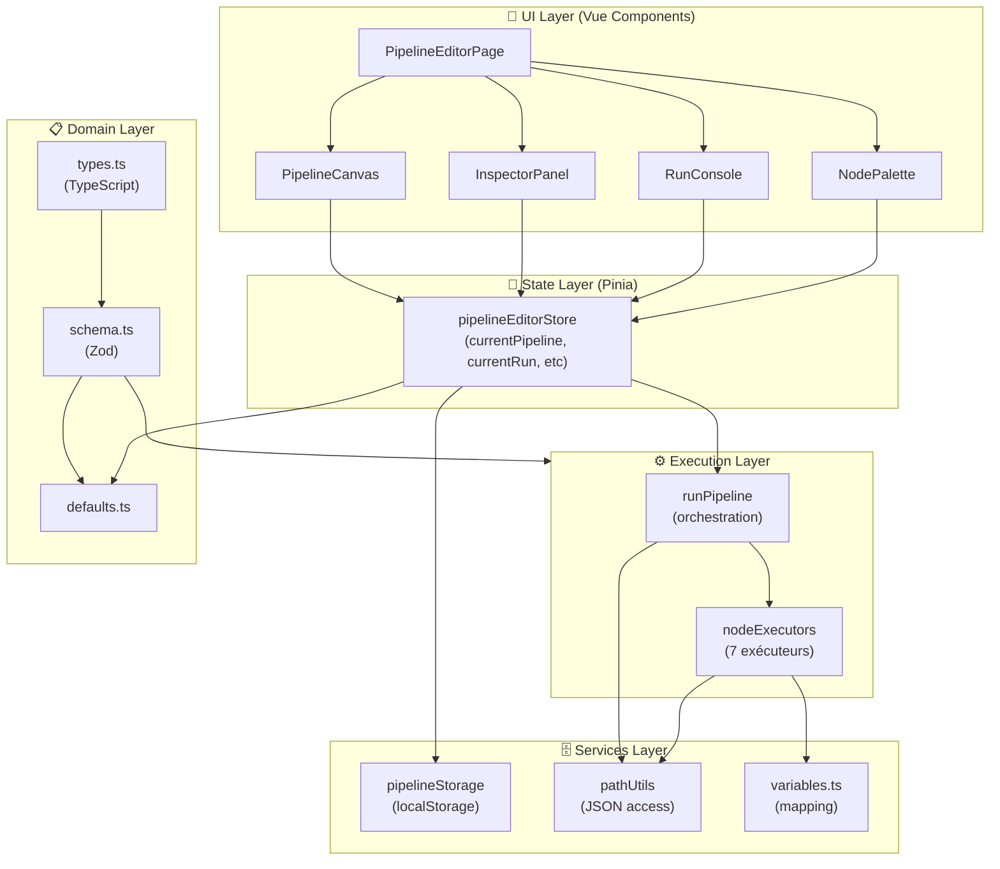

---

## Flux d'exécution pipeline

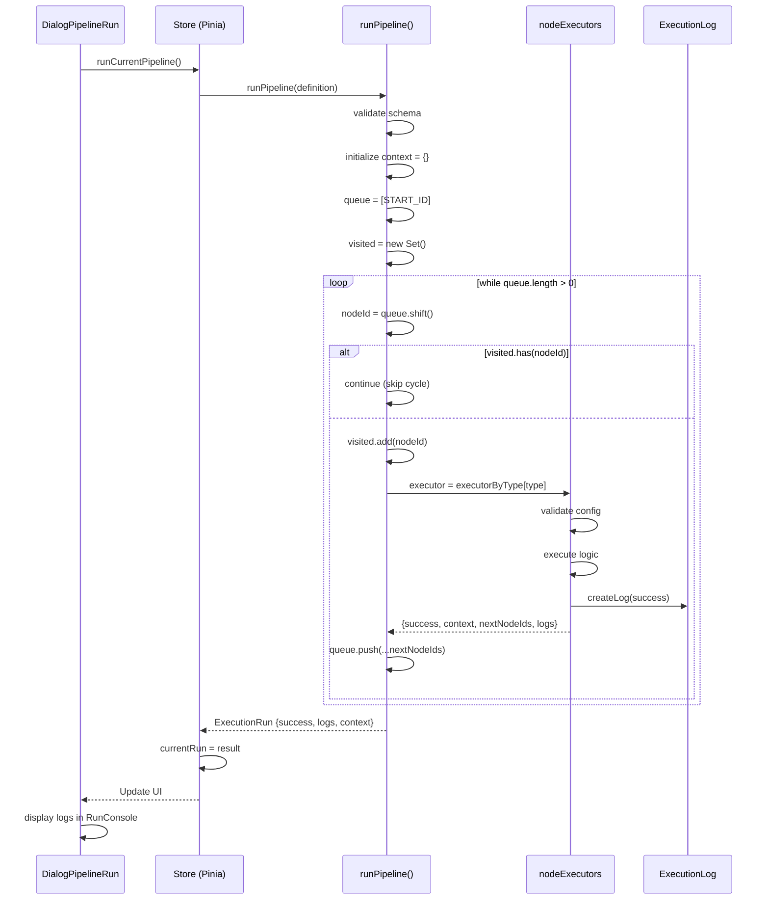

---

## Arborescence type de nœuds

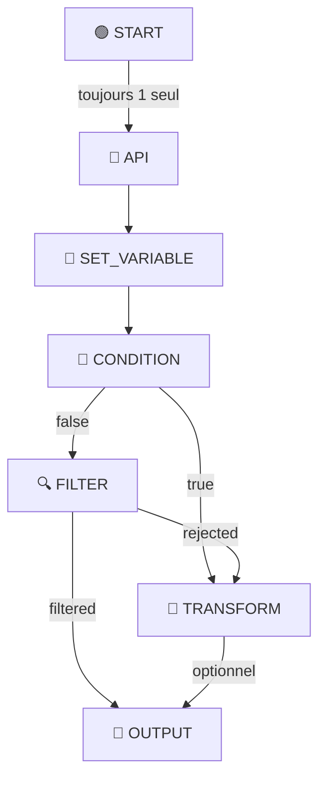

---

## Structure domaine - Types de données

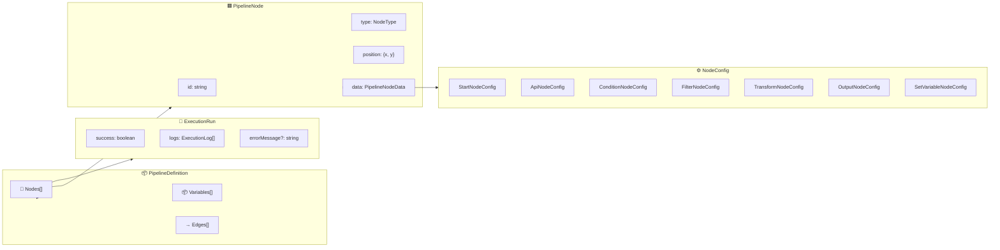

---

## Types de nœuds avec leurs branches

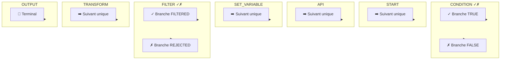

---

## Cycle de vie composant Vue

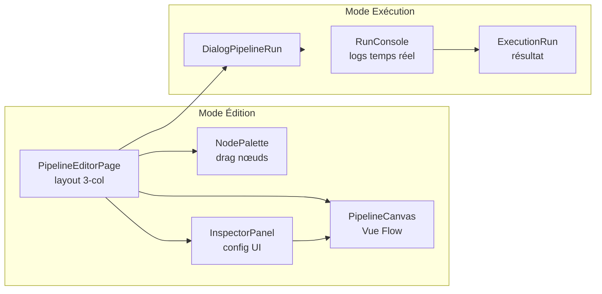

---

## Flux validation données

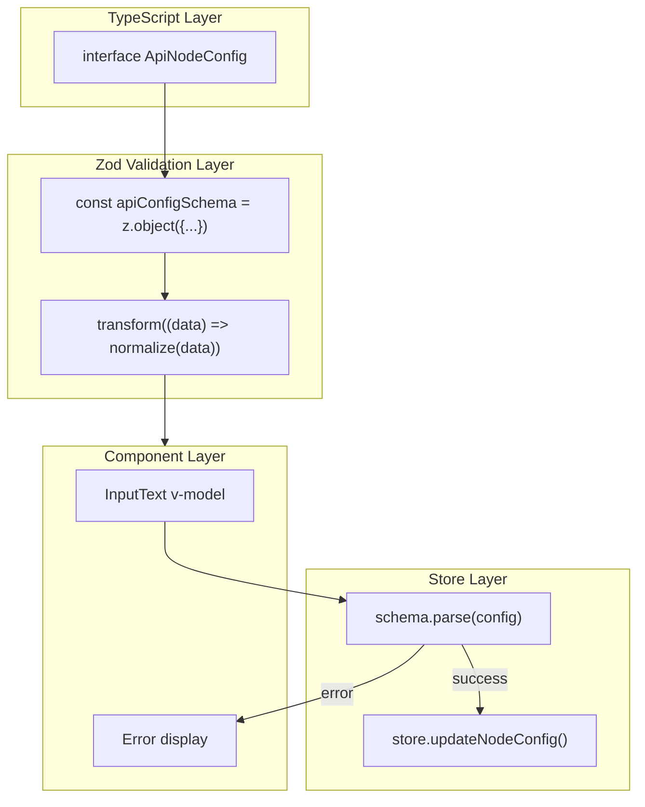

---

## État Pinia store

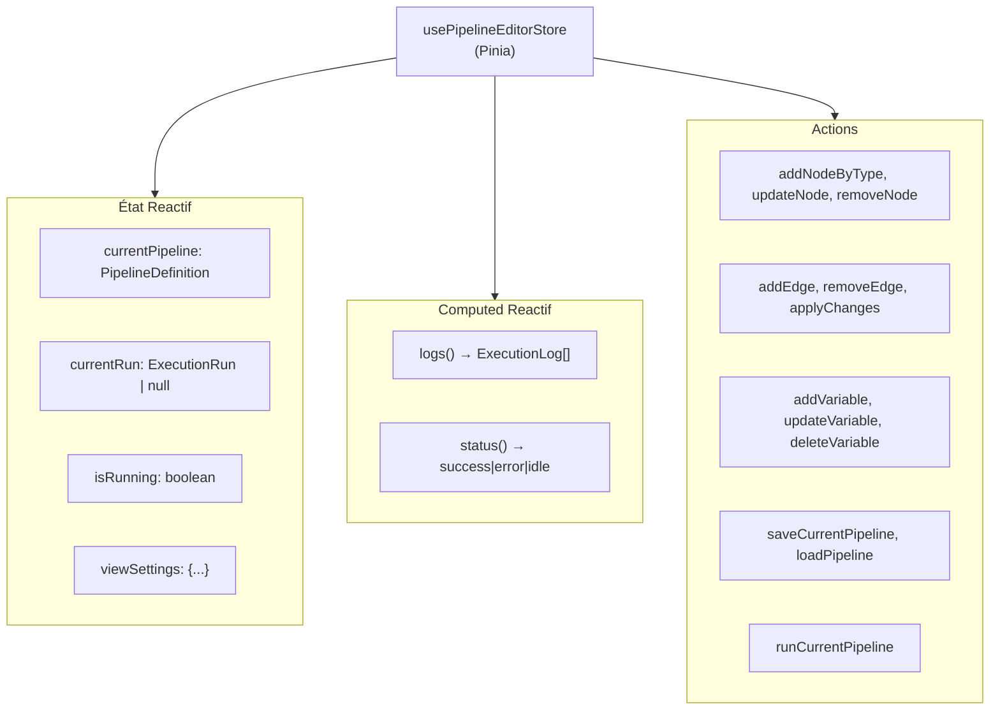

---

## Moteur d'exécution - Dispatch exécuteurs

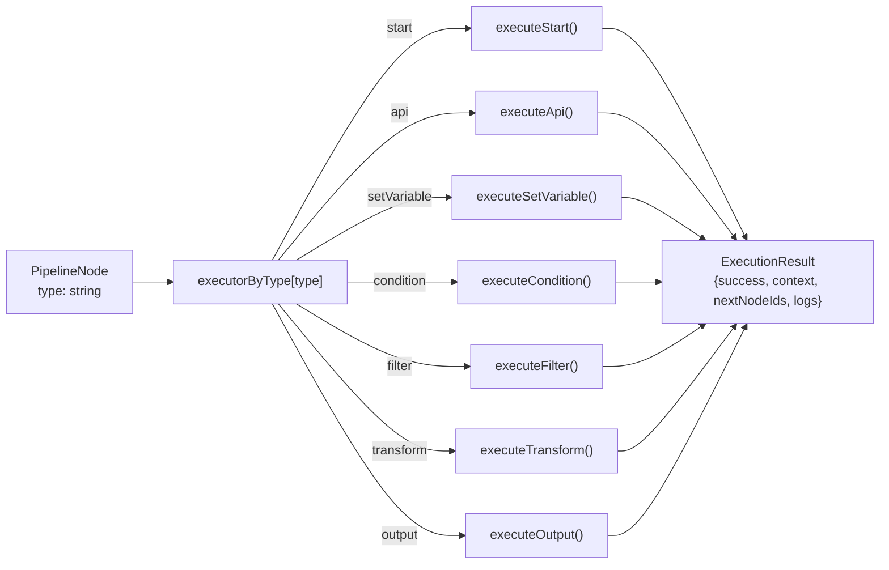

---

## Persistance localStorage

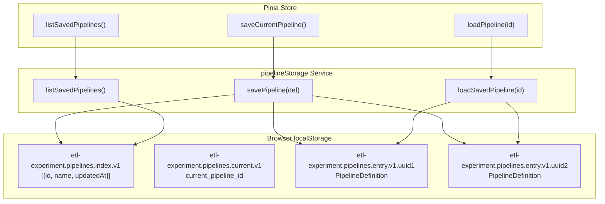

---

## Import dependencies map

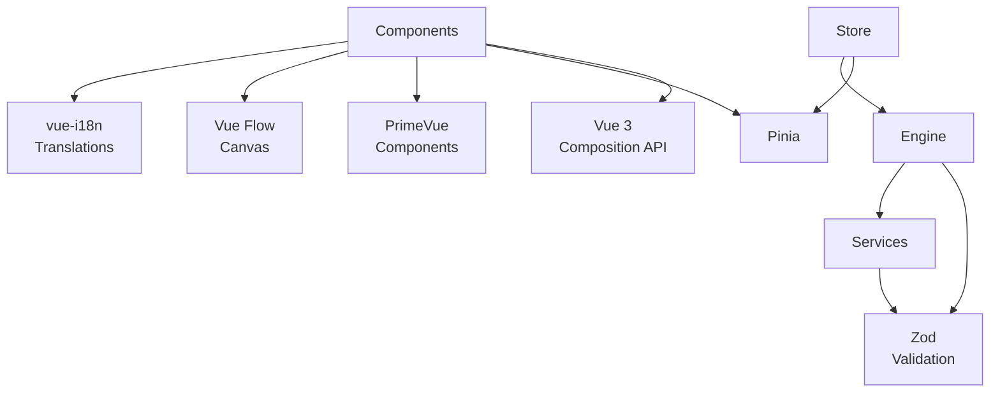

---

## Processus intégration continue locale

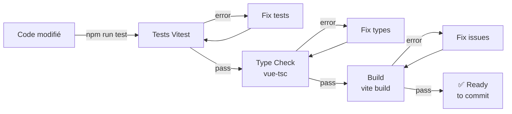

---

## Glossaire avec emojis

| Emoji | Terme | Signification |
|-------|-------|--------------|
| 🟢 | START | Nœud démarrage pipeline |
| 🔷 | API | Nœud requête HTTP |
| 📝 | SETVAR | Nœud extraction variables |
| 🔀 | CONDITION | Nœud branchement 2 voies |
| 🔍 | FILTER | Nœud filtre array |
| 🔄 | TRANSFORM | Nœud transformation données |
| 🔴 | OUTPUT | Nœud résultat final |
| 📦 | PIPELINE | Ensemble nœuds + arêtes |
| → | EDGE | Connexion nœuds |
| ⚙️ | CONFIG | Paramètres nœud |
| 🎯 | EXECUTION | Résultat exécution |
| 📋 | LOG | Message événement exécution |

